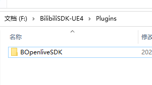
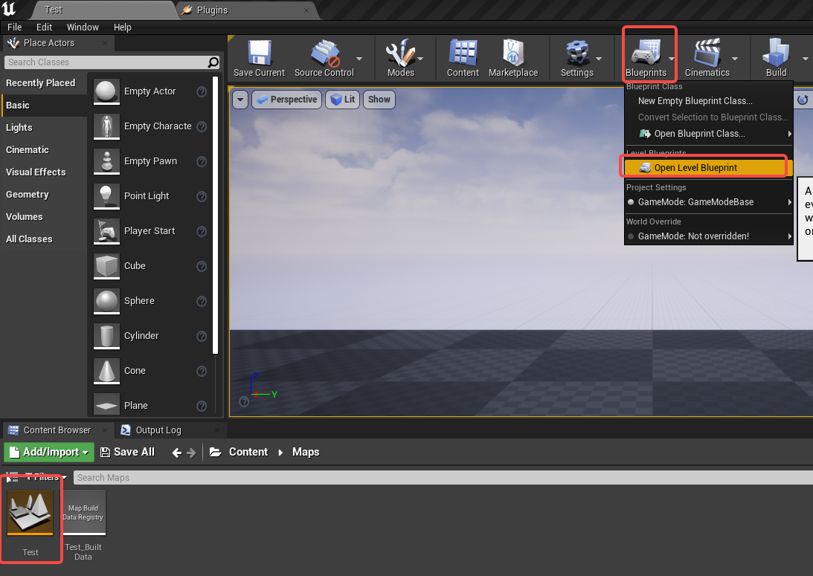
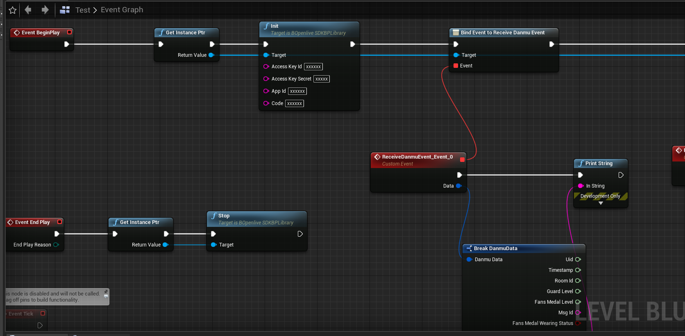
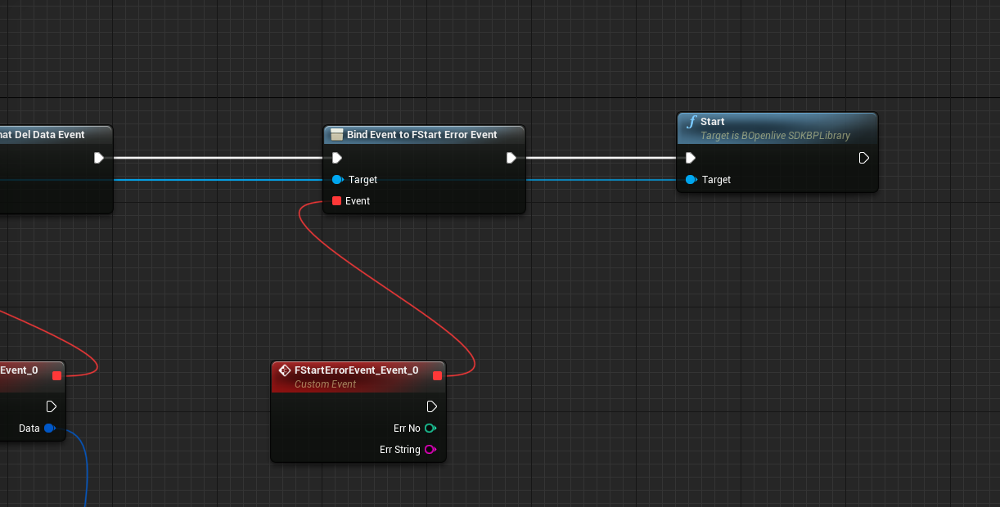
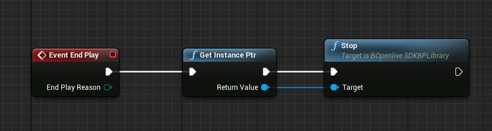

# BOpenliveSDK-UE4
Blibili直播弹幕互动官方接口
- 隔壁Unity都有sdk，我们大UE也必须有
- 目前实现的接口有：初始化参数、开启游戏、关闭游戏，实现的通知消息有：弹幕消息、礼物消息、SC消息、SC撤回消息、舰长消息
- 内部实现了websocket自动重连机制，无需开发者额外操作即可自动重连
- 纯C++代码插件，核心代码均用的是原生C++代码，如果想参考此插件移植到其他C++平台也很轻松

## 插件接入流程（图文教程）
1. 将此示例项目里的Plugins\BOpenliveSDK文件夹复制到自己项目的Plugin目录中
   
2. 接入完毕，是不是很easy

## 插件使用教程（图文教程）
1. 此插件接口的使用示例，在默认关卡（Test）的关卡蓝图中，可以按照自己项目的实际情况，按需写入自己的项目中
   
2. 此插件使用了单例模式，所以调用函数需要使用GetInstancePtr函数，之后调用Init函数，传入Keyid,KeySecret,Appid,Code，之后绑定各个消息事件，所需要的消息绑定后，再调用Start函数即可开启长链
   
   
3. 在游戏结束时，或者根据自己需要，需要调用Stop函数，来关闭当前长链
   

## 插件目录结构介绍
1. Tool文件夹：里面是从网上找的json库和哈希库
2. BApi.cpp：封装了http接口
3. BApiInfo.cpp：封装了Bilibili弹幕直播数据的结构体，同时也将这些结构体暴露给了蓝图
4. BOpenliveSDK.cpp：新建插件自带的文件，没什么具体的作用
5. BOpenliveSDKBPLibrary.cpp：主流程类，同时也将函数、消息暴露给蓝图使用
6. BWebsocket.cpp：封装了UE自带的websocket，主要用来建立B站长链，接受和发送websocket数据
7. 更多详细信息可以查看代码中的注释，我会尽可能的多加一些注释

## 注意事项
1. FStartErrorEvent此消息是在开启长链时，如果开启失败，会发送这个消息，开发者接收到这个消息时，可以弹窗提示网络错误，后续如果想要继续开启长链，需再次调用Start函数
2. 成功开启长链后，插件自动处理重连功能，无需开发者再进行额外操作
3. 因为核心代码用的是原生C++，UE本身的东西只有在必要的地方有使用，所以理论上此插件应该满足大多数UE版本，本人是在4.27版本上测试的，后续如果有其他版本使用有问题的情况，可以提Issues

## 特别鸣谢
项目参考：https://github.com/CXHGT/BilibiliSdkDemo

此插件是根据该项目，进行的移植，同时增加了代码的健壮性，
